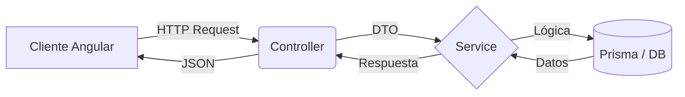

# ☕ Coffee Shop E-commerce

Una plataforma de comercio electrónico completa y robusta diseñada para la venta de productos de especialidad. Este proyecto demuestra la implementación de una arquitectura **Fullstack moderna**, enfocada en la escalabilidad, la seguridad y una experiencia de usuario fluida.

El objetivo principal es resolver desafíos técnicos reales como la gestión de inventario, persistencia de carritos de compra y autenticación segura.

## 🚀 Stack Tecnológico

El proyecto está construido utilizando una arquitectura separada (Frontend y Backend) para garantizar modularidad.

### Backend (API REST)
* **Framework:** [NestJS](https://nestjs.com/) (Arquitectura modular y escalable).
* **Lenguaje:** TypeScript.
* **Base de Datos:** PostgreSQL (alojada en Supabase).
* **ORM:** Prisma (Modelado de datos y migraciones type-safe).
* **Autenticación:** JWT (JSON Web Tokens) & Passport.
* **Documentación:** Swagger / OpenAPI.
* **Testing:** JEST.

### Frontend (Cliente)
* **Framework:** [Angular](https://angular.io/) (Estructura de componentes y servicios).
* **Estilos:** Tailwind CSS (Diseño responsivo y moderno).
* **Gestión de Estado:** RxJS.

---

## 🌟 Funcionalidades Clave

### 👤 Módulo de Usuarios & Autenticación
* **Registro y Login:** Autenticación segura con hasheo de contraseñas (Bcrypt) y emisión de JWT.
* **Gestión de Perfil:** Los usuarios pueden actualizar sus datos personales, avatar y direcciones de envío.
* **Roles (RBAC):** Sistema de permisos para diferenciar entre `ADMIN` (gestión total) y `NORMAL` (compra).

### 🛍️ Catálogo y Productos
* **Listado Inteligente:** Visualización de productos con filtrado y búsqueda.
* **Gestión de Inventario:** Control de stock en tiempo real.
* **Detalle de Producto:** Vistas individuales con imágenes, descripción y precio.

### 🛒 Carrito y Checkout
* **Carrito Persistente:** La información del carrito se guarda en base de datos, permitiendo recuperar la sesión desde cualquier dispositivo.
* **Validación de Stock:** Verificación de disponibilidad antes de confirmar la compra.
* **Cálculo de Envíos:** (En desarrollo) Lógica para calcular costos basados en dirección y peso.

### 🔍 Detalles
* **Integración de pasarela de pagos:** Stripe/Mercado Pago.
* **Sistema de notificaciones por email al completar orden.**
* **Dashboard de administrador con gráficas de ventas.**
* **Tests unitarios y de integración (Jest).**

---

## 📂 Arquitectura del Proyecto

El backend sigue una arquitectura en capas típica de NestJS para asegurar la separación de responsabilidades:

1.  **Controllers:** Reciben las peticiones HTTP (Entrada).
2.  **Services:** Contienen la lógica de negocio (Validaciones, cálculos).
3.  **Data Layer (Prisma):** Comunicación directa con la base de datos PostgreSQL.

---

Developed by Marcos Aguirre https://www.linkedin.com/in/marcosaguirre9/
